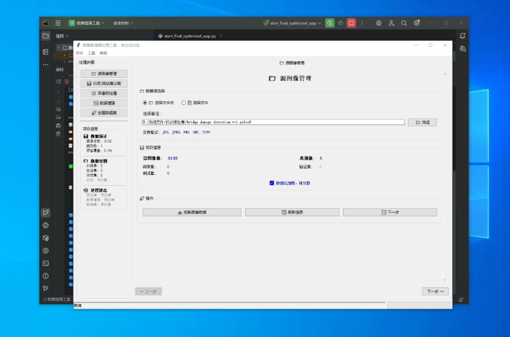
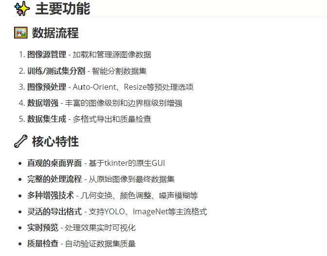
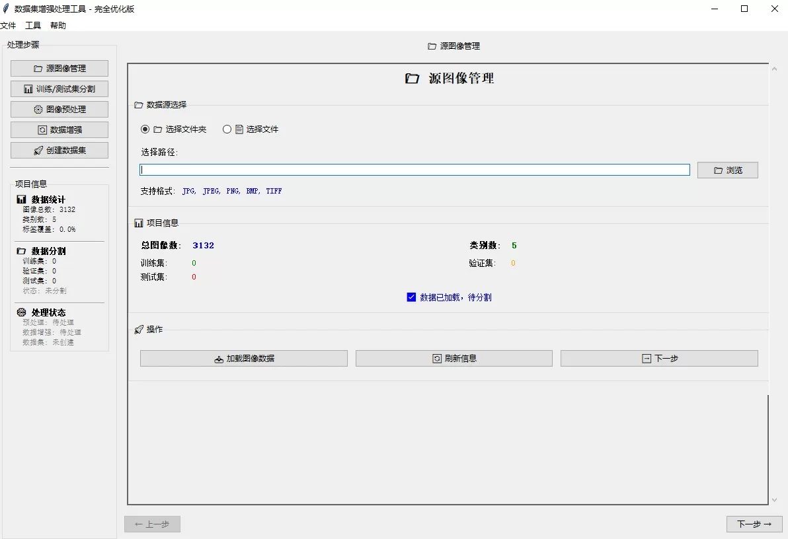
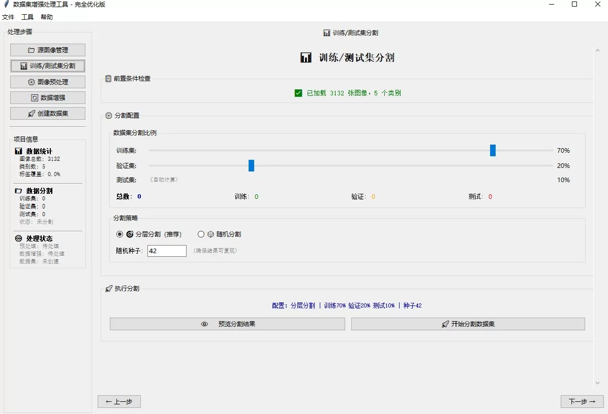
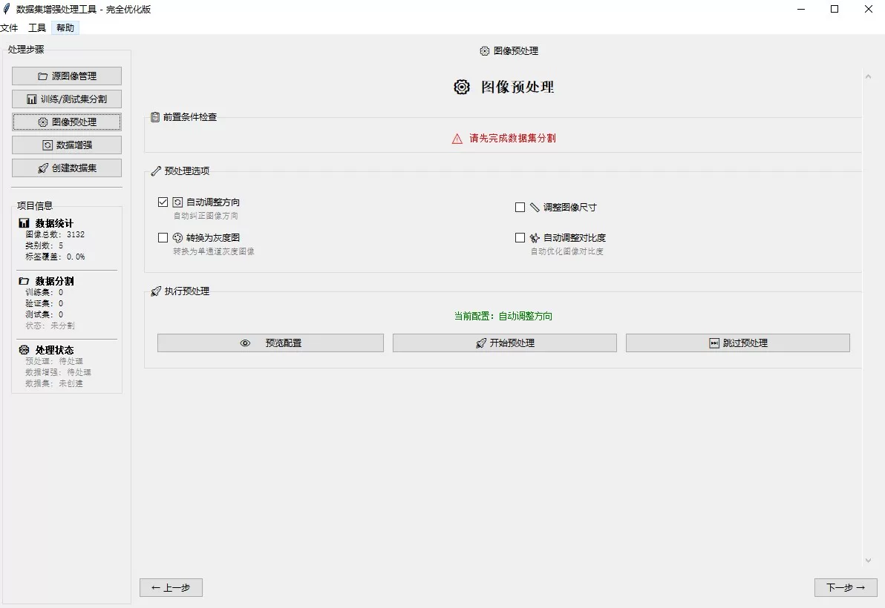
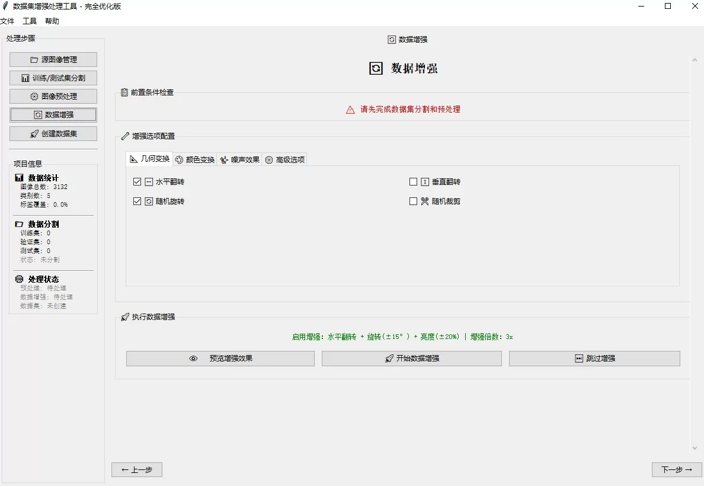

## Body

A fully functional dataset augmentation tool with an intuitive desktop GUI interface.

Step 1: Image Source Management
- Browsing and selecting image folders containing images
- Supporting multiple image formats (JPG, PNG, BMP, TIFF)
- Automated analysis of category structures
- Previewing image content

Step 2: Dataset Splitting
- Setting the training/validation/test set ratio
- Selecting splitting strategies (layered, random, manual)
- Previewing the split results
- Ensuring a reasonable distribution of data

Step 3: Image Preprocessing
- Configuring preprocessing options:
- Auto-Orient: Automatically adjusting the image orientation
- Resize: Resizing the image to 640×640
- Grayscale: Converting to grayscale
- Auto-adjust Contrast: Automatically adjusting contrast
- More advanced options...
- Real-time preview of processing effects
- Bulk processing settings

Step 4: Data Augmentation
Selecting augmentation types:
- Image level augmentations
---- Geometric transformations: Flip, Rotate, Crop, Cut
---- Color adjustments: Brightness, Contrast, Saturation, Tone
---- Noise blurring: Gaussian noise, blur effect
---- Occlusion cropping: Random occlusion, mosaic enhancement

- Bounding box level augmentations
---- Geometric transformations that maintain the accuracy of annotation boxes
---- Suitable for object detection tasks
---- Synchronizes updates to the image and annotation information

Step 5: Dataset Generation
- Select export formats (YOLO, ImageNet, etc.)
- Configuring dataset information
- Performing quality checks
- Exporting the final dataset

## Images

item_1061993844500

Here is a pay link on Stripe ( https://buy.stripe.com/3cs8yP7sY87d0vu9AB ). Please contact me lonlonago@foxmail.com after funding $89, and I will send you a complete data files , thank you!

